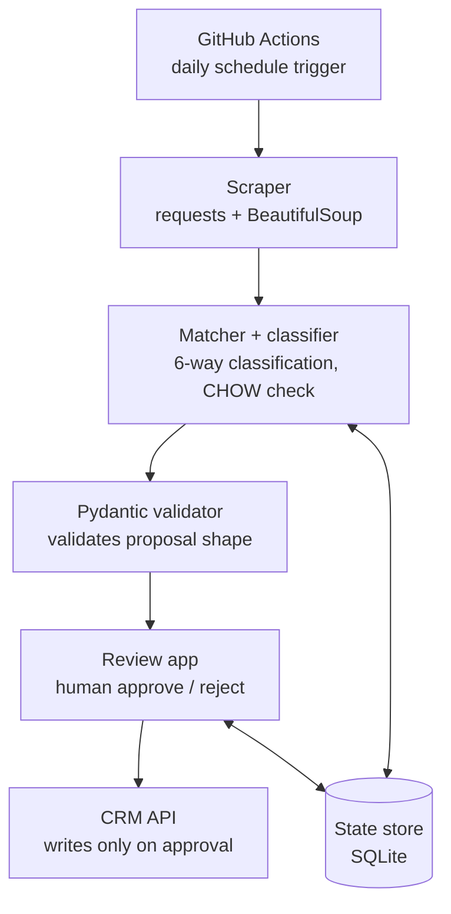

# Architecture

## Diagram

Teal-equivalent (automated pipeline): Scraper, Matcher, Validator.
Human gate: Review app. Infra: trigger, state store, CRM API.

## Components

### 1. Scraper (`src/scraper.py`)
Pulls Bellhaven's location list (name, address, city, state, zip, care
offerings) from their public site. CSS selectors are isolated in a
`SELECTORS` dict — update after inspecting the real site markup.

### 2. Matcher + classifier (`src/matcher.py`)
Fuzzy-matches each scraped location against CRM accounts and produces
proposals for six outcomes:

- **no_change** — confident match, nothing to fix (no proposal generated)
- **needs_fix** — wrong `parent_id` or stale name
- **no_account_yet** — on the website, missing from CRM
- **vanished_from_website** — under Bellhaven in CRM, not on the site
- **misparented** — reserved for cases needing human judgment where no
  clean match target exists (flagged `Needs Review`, never auto-reassigned)
- **duplicate** — two CRM accounts under Bellhaven that appear to be the
  same facility

The CHOW check (`src/chow.py`) runs inside the `needs_fix` path before
any re-parent is proposed.

### 3. CHOW rule (`src/chow.py`)
Isolated, pure, unit-tested (`tests/test_chow.py`). Implements the
brief's SOP exactly:

- `lifetime_revenue > 0` **and** `outstanding_ar > 0` → preserve the old
  account untouched, create a new account under the correct parent, set
  `chow_current_account` on the old account to the new id.
- Otherwise → re-parent the existing account directly.

### 4. Pydantic validator (`src/validators.py`)
`ProposedChange` model — every proposal must have non-empty evidence,
a valid `status` value if one is set, and a `duplicate_of_account`
target if classified as a duplicate. Runs before a proposal reaches
the review app.

### 5. State store (`src/state_store.py`)
SQLite table keyed on `account_id + classification` (not the random
proposal id), so a second pipeline run recognizes an already-decided
item and skips it — this is what satisfies the idempotency requirement.

### 6. Review app (`src/review_app.py`)
Local Flask app. Shows each pending proposal with its evidence. The
only function in the entire codebase that calls `CRMClient.create_account`
or `.update_account` is `_apply_to_crm()`, triggered only on approve.

### 7. CRM client (`src/crm_client.py`)
Thin wrapper around the sandbox API. All endpoint paths are in
`src/config.py` — a docs mismatch or a live-demo change to the API
contract is a one-file fix, not a rewrite.

### 8. Schedule (`.github/workflows/daily-hygiene.yml`)
Runs the pipeline daily via GitHub Actions cron. Only queues proposals
— never approves. Approval remains a deliberate human step.
